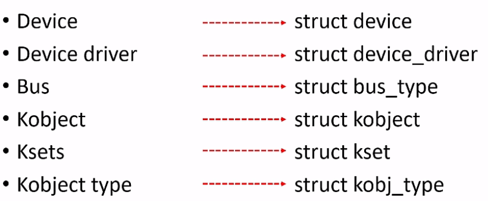
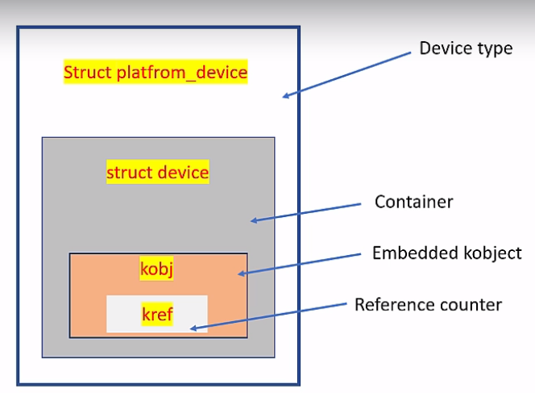
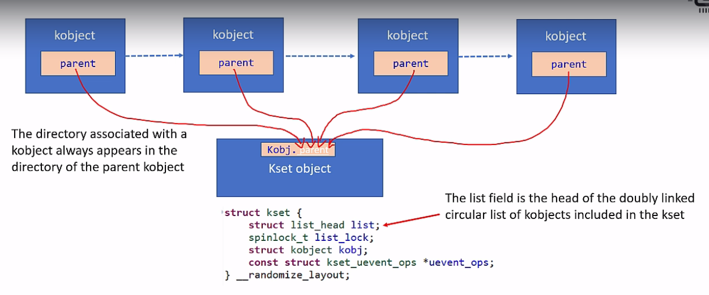
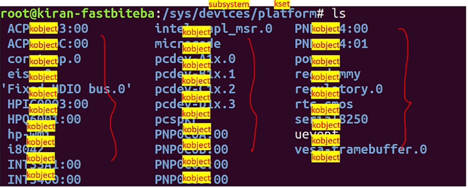
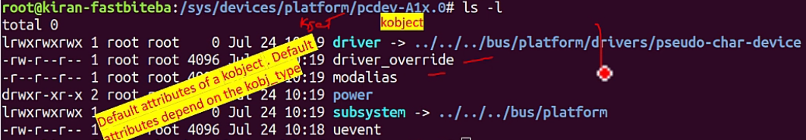

# Linux Drivers Model

## General information

Every bus (platform driver) and device is represented in `/sysfs (/sys)` subsystem.
On the lowest level (in the code) they are represented by following structures:



Note that there are many of already defined device drivers subsystems in Linux like:
- I2C
  - it's represented by `struct i2c_client`
  - module registering done with `module_i2c_driver` macro
- SPI
  - it's represented by `stuct spi_driver`
  - module registring done with `module_spi_driver` macro

## Makefile for driver

Special names:
- `obj-[y|m|n] := <driver_name>.o`
- `<driver_name-objs> += <dependencies for this driver>`

## Kobject

This is `struct kobject` which is normally a member of other "container" type struct like `struct device`.
One of the most important features of `kobject` are:
- reference count - each `kobject` has `kref` member. When user space creates a reference to this `kobject`, it's incremented to 1. When the value loweres to 0 the `release` function of `ktype` is called.
- attributes like name, type, parent pointer, permissions (some of the attributes can be altered by user space)

Typical hierarchy:



Definition of `struct kobject` can be found in `include/linux/kobject.h`.

```c
struct kobject {
	const char		*name;
	struct list_head	entry;
	struct kobject		*parent;
	struct kset		*kset;
	const struct kobj_type	*ktype;
	struct kernfs_node	*sd; /* sysfs directory entry */
	struct kref		kref;
#ifdef CONFIG_DEBUG_KOBJECT_RELEASE
	struct delayed_work	release;
#endif
	unsigned int state_initialized:1;
	unsigned int state_in_sysfs:1;
	unsigned int state_add_uevent_sent:1;
	unsigned int state_remove_uevent_sent:1;
	unsigned int uevent_suppress:1;
};

struct kobj_type {
	void (*release)(struct kobject *kobj);
	const struct sysfs_ops *sysfs_ops;
	struct attribute **default_attrs;	/* use default_groups instead */
	const struct attribute_group **default_groups;
	const struct kobj_ns_type_operations *(*child_ns_type)(struct kobject *kobj);
	const void *(*namespace)(struct kobject *kobj);
	void (*get_ownership)(struct kobject *kobj, kuid_t *uid, kgid_t *gid);
};

struct kobj_uevent_env {
	char *argv[3];
	char *envp[UEVENT_NUM_ENVP];
	int envp_idx;
	char buf[UEVENT_BUFFER_SIZE];
	int buflen;
};
```

### `struct kobj_type`

This structure is used to define the default behaviour (e.g. attributes) for a group of kobjects of same container type (container type could be `struct device`, `struct platform_device`, `struct bus` etc.).

Every structure that embeds `kobject` needs corresponding `kobj_typ`. `kobj_typ` defines behaviours like below:
- what happens to the `kobject` when it's created or destroyed
- defines attributes and file operations

### `struct kset`

It's a set of `struct kobject` objects which belongs to the same type `struct kobj_type`.



Kobject, kset and subsystem may be explained with the following image:



Kobject attributes in sysfs:



## sysfs

Enabled in kernel if compiled with `CONFIG_SYSFS`. Can be accessed by doing `mount -t sysfs syfs /sysfs`

### sysfs attributes

These are represented by files or symbolic links in sysfs. They bring some information about driver / device to user space.

This is represented as `struct attribute`. There are two important members:
- name - this is the name of a file in sysfs
- mode - permission modes like, `S_IRUGO` and `S_IRUSR` which are defined in `stat.h`.

`struct device_attribute` holds handlers for attribute. It contains also `struct attribute` member, thats why this structure should be used for attribute creation. There are `DEVICE_ATTR_XX` macros for device attribute creation.

#### `show` callback

Prototype: `ssize_t (*show)(struct device *dev, struct device_attribute *attr, char *buf)`

__WARNING: `buf` is kernel space pointer, therefore its size is `PAGE_SIZE`. In ARM `PAGE_SIZE = 4096`__

`show` method should be used to read a single data from a driver (less than `PAGE_SIZE`) while `read` should be used to read large amount of data to the user space.

#### `store` callback

Prototype: `ssize_t (*store)(struct device *dev, struct device_attribute *attr, const char *buf, size_t count)`.

`buf` is user space pointer and cannot be bigger than `PAGE_SIZE`.