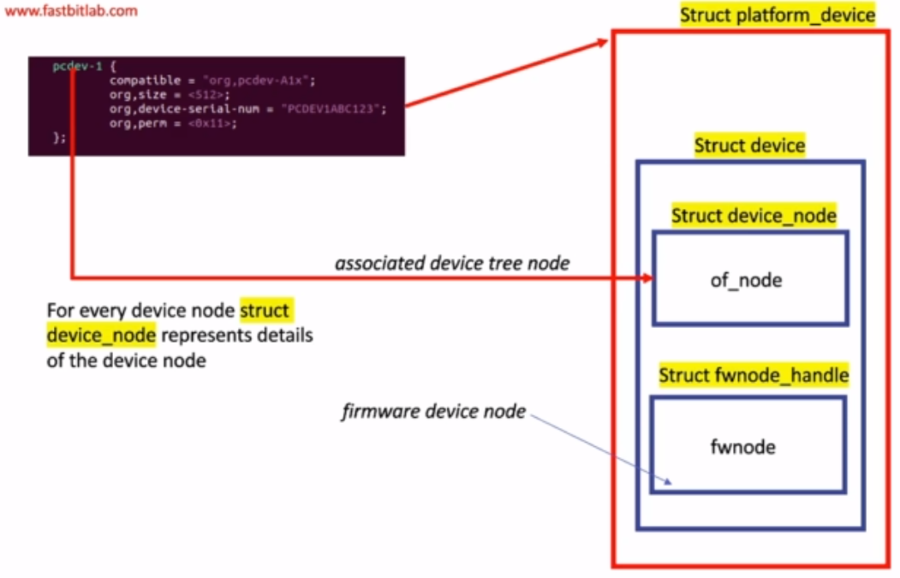
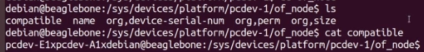

# 1. ldd
Linux drivers course materials
Course git repository: https://github.com/niekiran/linux-device-driver-1

- [1. ldd](#1-ldd)
  - [1.1. Kernel source online viewer](#11-kernel-source-online-viewer)
  - [1.2. Host OS dependencies](#12-host-os-dependencies)
    - [1.2.1. Docker](#121-docker)
  - [1.3. Linux module building](#13-linux-module-building)
    - [1.3.1. Intree module building](#131-intree-module-building)
  - [1.4. Tools](#14-tools)
  - [1.5. Testing from a SHELL](#15-testing-from-a-shell)
  - [1.6. Kernel APIs for drivers](#16-kernel-apis-for-drivers)
    - [1.6.1. printk priorities](#161-printk-priorities)
    - [1.6.2. printk format customization](#162-printk-format-customization)
    - [1.6.3. File operations](#163-file-operations)
      - [1.6.3.1. open](#1631-open)
      - [1.6.3.2. release](#1632-release)
      - [1.6.3.3. read / write](#1633-read--write)
      - [1.6.3.4. Error handling macros](#1634-error-handling-macros)
    - [1.6.4. Resource managed kernel APIs](#164-resource-managed-kernel-apis)
      - [1.6.4.1. `devm_kmalloc`](#1641-devm_kmalloc)
  - [1.7. Kernel dynamic memory allocation](#17-kernel-dynamic-memory-allocation)
    - [1.7.1. `void* kmalloc(size_t size, gfp_t flags)`](#171-void-kmallocsize_t-size-gfp_t-flags)
    - [1.7.2. `void kfree(const void *p)`](#172-void-kfreeconst-void-p)
  - [1.8. Dynamic device file creation](#18-dynamic-device-file-creation)
  - [1.9. Beaglebone](#19-beaglebone)
    - [1.9.1. Toolchain](#191-toolchain)
  - [1.10. Linux kernel build steps (on BeagleBoard example)](#110-linux-kernel-build-steps-on-beagleboard-example)
  - [1.11. Platform Bus](#111-platform-bus)
    - [1.11.1. Passing configuration to the kernel](#1111-passing-configuration-to-the-kernel)
    - [1.11.2. Platform devices](#1112-platform-devices)
    - [1.11.3. Platform driver](#1113-platform-driver)
      - [1.11.3.1. Registering platform driver in the kernel](#11131-registering-platform-driver-in-the-kernel)
    - [1.11.4. Platform device to platform driver matching](#1114-platform-device-to-platform-driver-matching)
      - [1.11.4.1. Platform driver callbacks](#11141-platform-driver-callbacks)
    - [1.11.5. Platform bus flow](#1115-platform-bus-flow)
      - [1.11.5.1. Platform matching mechanism](#11151-platform-matching-mechanism)
  - [1.12. Device Tree](#112-device-tree)
    - [1.12.1. Properties](#1121-properties)
      - [1.12.1.1. Node name](#11211-node-name)
      - [1.12.1.2. Compatible](#11212-compatible)
    - [1.12.2. How to find a list of compatibilie devices to a driver](#1122-how-to-find-a-list-of-compatibilie-devices-to-a-driver)
    - [1.12.3. Bindings](#1123-bindings)
    - [1.12.4. Linux conventions](#1124-linux-conventions)
    - [1.12.5. Adding own Device Tree procedure](#1125-adding-own-device-tree-procedure)
    - [1.12.6. Usage in platform driver](#1126-usage-in-platform-driver)
    - [1.12.7. Compiling Device Tree](#1127-compiling-device-tree)
      - [1.12.7.1. Using compiled `.dtb`](#11271-using-compiled-dtb)
        - [1.12.7.1.1. Checking if changes in `.dtb` are visible on target](#112711-checking-if-changes-in-dtb-are-visible-on-target)

## 1.1. Kernel source online viewer

1. https://code.woboq.org/linux
2. https://elixir.bootlin.com/linux/latest/source
## 1.2. Host OS dependencies

- build-essential
- lzop
- u-boot-tools
- net-tools
- bison
- flex
- libssl-dev
- libncurses5-dev
- libncursesw5-dev
- unzip
- chrpath
- xz-utils
- minicom
- wget
- git-core

```bash
sudo apt-get update
sudo apt-get install build-essential lzop u-boot-tools net-tools bison flex libssl-dev libncurses5-dev libncursesw5-dev unzip chrpath xz-utils minicom wget git-core
```

### 1.2.1. Docker

You can use __docker__ with all dependencies.

```bash
# Build image
docker build --rm -t ldd:latest .

# run container
docker run --rm -v <path_to_source_code>:/workspace -it ldd:latest
```

## 1.3. Linux module building

```bash
# Building module
# make -C <path_to_kernel_source> M=<path_to_module_source> <target>
make -C /lib/modules/5.16.0-12parrot1-amd64/build M=$PWD modules

# Cleaning
make -C /lib/modules/5.16.0-12parrot1-amd64/build M=$PWD clean
```

### 1.3.1. Intree module building

1. Download Linux Kernel source
2. Create a new folder in `drivers/<type_of_driver>/<driver_name>`, e.g. `drivers/char/my_c_dev/`
3. Copy source code into the directory
4. If you want your module to be visible in the `menuconfig` you should deliver also `Kconfig` file in the driver directory
5. Add the local Kconfig entry to upper level Kconfig, e.g. `source "drivers/char/my_c_dev/Kconfig`
6. Create local Makefile
7. Create `obj-$(config_item) += <module_name.o>`
    Because we do not know what config was chosen (m|n|y), we can use config name preceeded with CONFIG keyword, e.g. `obj-$(CONFIG_DRIVER_NAME_IN_MENUCONFIG) += main.o`
8. Add the local level Makefile into the upper level Makefile `obj-<config [y|m|n]> += <driver_path>`, e.g. `obj-y += my_c_dev`. __Note__: when config used `y`, then the folder will be always enabled (not the module itself, but the folder).

__Kconfig example__:
```
menu "Menu entry header description"
config DRIVER_NAME_IN_MENUCONFIG
    tristate "Short description of the module"
    default [n|m|y]
endmenu
```

## 1.4. Tools

- `udevadm`

## 1.5. Testing from a SHELL

- Writing into the driver - `echo "Message" > /dev/<driver>`, e.g. `echo "Hello" > /dev/pcd`
- Reading from the driver - `cat /dev/<driver>`, e.g. `cat /dev/pcd`
- Copying the file into the driver - `cp <file> /dev/<driver>`, e.g. `cp /tmp/file /dev/pcd`

## 1.6. Kernel APIs for drivers

- `alloc_chrdev_region()` - create device number
- `unregister_chrdev_region()`. This allows to allocate device and assigne a device_number to it. It is allowed to allocate multiple devices at once, e.g. `alloc_chrdev_region(&device_number, 0, NO_OF_DEVICES, "pcd_devices")` - it allocates `NO_OF_DEVICES` devices and saves first number into `device_number`. Using any other device is allowed by merging MAJOR and MINOR numbers.
- `cdev_init()`, `cdev_add()` - make a char device registration with the VFS
- `cdev_del()`
- `class_create()`, `device_create()` - create device files
- `class_destroy()`, `device_destroy()`

### 1.6.1. printk priorities

The default priorities can be setup in `menuconfig` before kernel compilation.
In runtime it can be setup by overwriting `/proc/sys/kernel/printk` file, e.g. we can change the console log level
to 6 by `echo 6 > /proc/sys/kernel/printk`. Message from `printk` will be printed on a console when `printk`
priority is lower than current console log level.

### 1.6.2. printk format customization

User can define its own `pr_fmt` macro, e.g.

```c
#define pr_fmt(fmt) "%s:" fmt,  __func__
```

### 1.6.3. File operations

These are represented by `struct file`.

#### 1.6.3.1. open

This operation creates `struct file` in the kernel space for each opened file descriptor.
Each call to `open` increments `f_count`.

File permissions which was passed to the `open` system call can be checked using `FMODE_WRITE` / `FMODE_READ` macros (bit masks) and the member of the `struct file` named `f_mode`, e.g. `filp->f_mode & FMODE_READ`.

#### 1.6.3.2. release

This callback is issued when the last `close` is called. It means that the callback
is called only when `f_count` becomes 0.

#### 1.6.3.3. read / write

In the prototype, there is an `__user` macro used. This macro is used to signal that the variable
that it corresponds to is a user space data which kernel shouldn't trust, e.g. pointer - it shouldn't
be dereferenced directly, but `copy_to_user` / `copy_from_user` should be used instead.

When `__user` macro is used, it is detected by `sparse` tool (GCC doesn't detect any errors).

- `copy_to_user` - returns 0 on success or number of bytes that could not be copied
- `copy_from_user` - returns 0 on success or number of bytes that could not be copied

#### 1.6.3.4. Error handling macros

In `include/linux/err.h`:
- `IS_ERR()`
- `PTR_ERR()`
- `ERR_PTR()`

### 1.6.4. Resource managed kernel APIs

Full list of this APIs may be found [here](https://www.kernel.org/doc/Documentation/driver-model/devres.txt).

#### 1.6.4.1. `devm_kmalloc`

Allocates a resource and remembers what has been allocated. Programmer won't have to use `kfree`
because this resource will be freed by kernel.


## 1.7. Kernel dynamic memory allocation

Kernel has its own implementations of allocation / deallocation functions - `kmalloc` and `kfree`.

### 1.7.1. `void* kmalloc(size_t size, gfp_t flags)`

Defined in `include/linux/slab.h`.
Allocated memory is contigueues and __its size is limited__. This is a good practice to use `kmalloc` for
allocations smaller than the page size (most likely 4 kB).

Important flags:
- `GFP_KERNEL` - may block / sleep (better not to use in a time fragile code like interrupts)
- `GFP_NOWAIT` - will not block
- `GFP_ATOMIC` - will not block. May use emergency pools.
- `GFP_HIGHUSER` - allocates from high memory on behalf of user

`kmalloc` flavors:
- `kmalloc_array`
- `kcalloc`
- `kzalloc` - allocated memory is set to zero
- `krealloc`

### 1.7.2. `void kfree(const void *p)`

`kfree` flavors:
- `kzfree` - frees memory and set it to zero

## 1.8. Dynamic device file creation

There is a tool `udevd` which listens to `uevents` generated by hot plug events or kernel modules.
When `udev` received the `uevents`, it scans the subdirectories of `/sys/class` looking for the
`dev` files to create device files. For each such `dev` file, which represents a combination of major an minor
number for a device, the `udev` program creates a corresponding device file in `/dev` directory.

All that a device driver needs to do, for `udev` to work properly with it, is ensure that any major and minor
numbers assigned to a device controlled by the driver are exported to user space through sysfs. This is done by calling
the function `device_create`.

__Kernel functions__:
- `class_create` - creates a directory in sysfs: `/sys/class/<your_class_name>`
- `device_create` - creates a subdirectory under `/sys/class/<your_class_name>` with your device name.
  This function also populates sysfs entry with dev file which consists of the major and minor numbers,
  separated by a `:` character.

## 1.9. Beaglebone

### 1.9.1. Toolchain

Downloaded either from package manager or from [arm-Developer page](https://developer.arm.com/tools-and-software/open-source-software/developer-tools/gnu-toolchain/gnu-a/downloads).

Required version: _arm-linux-gnueabihf_.

## 1.10. Linux kernel build steps (on BeagleBoard example)

__Warning:__ These steps base on https://github.com/beagleboard/linux branch 4.14

__STEP 1:__
```bash
/*
 *removes all the temporary folder, object files, images generated during the previous build. 
 *This step also deletes the .config file if created previously 
 */
make ARCH=arm distclean
```

__STEP 2:__
```bash
/*creates a .config file by using default config file given by the vendor */

make ARCH=arm bb.org_defconfig
```

__Warning:__ This is valid only for branch 4.14 (and maybe some others) but not for the newer ones.
Newer kernel source code doesn't have the _bb.org_defconfig_ config file, therefore this won't work anymore.

__STEP 3:__
```bash
/*This step is optional. Run this command only if you want to change some kernel settings before compilation */ ​

make ARCH=arm CROSS_COMPILE=arm-linux-gnueabihf- menuconfig
```

__STEP 4:__
```bash
/*Kernel source code compilation. This stage creates a kernel image "uImage" also all the device tree source files will be compiled, and dtbs will be generated */ ​

make ARCH=arm CROSS_COMPILE=arm-linux-gnueabihf- uImage dtbs LOADADDR=0x80008000 -j4
```

__STEP 5:__
```bash
/*This step builds and generates in-tree loadable(M) kernel modules(.ko) */

make ARCH=arm CROSS_COMPILE=arm-linux-gnueabihf-  modules  -j4
```

__STEP 6:__
```bash
/* This step installs all the generated .ko files in the default path of the computer (/lib/modules/<kernel_ver>) */​

sudo make ARCH=arm  modules_install
```

## 1.11. Platform Bus

This is a virtual bus implementation in a Linux terminology. A Platform Bus is used to deliver
configuration information about a peripheral to the kernel. The devices served be Platrofm Bus
are non-discoverable (not hot-plug).

### 1.11.1. Passing configuration to the kernel

There are three ways:
- During compilation of a kernel (not recommended)
- Dynamically - by loading kernel module manually (not recommended)
- During kernel boot - Device Tree blob (recommended) [link](www.kernel.org/doc/Documentation/devicetree/usage-model.txt)

### 1.11.2. Platform devices

Devices that are connected to the Platform Bus (not supporting enumaration (dynamic discovery of devices)). Platform devices are created in `/sys/devices/platform`.

### 1.11.3. Platform driver

A driver who is in charge of handling a platform device.

#### 1.11.3.1. Registering platform driver in the kernel

Use the below C-macro:
- `platform_driver_register` from `include/linux/platform_device.h`

Platform driver is represented by `struct platform_driver`.

__Note:__ There is also `platform_add_devices` function which allows to add multiple devices at once.
There is no `platform_remove_devices` counterpart though.

### 1.11.4. Platform device to platform driver matching

The kernel holds matching table basing on names of platform driver and platform device.
When there is a match the `probe` function of a platform driver will be called.


When a new driver is added and there already is a matching device in the kernel list, the Platform Bus
matching process will be called and then `probe` function of the platform driver will be called.


Matching methods:
- id table matchint
- device tree metching

#### 1.11.4.1. Platform driver callbacks

`struct platform_driver`:
- `probe` is responsible for initialization of given platform driver.
- `remove` is responsible for unbinding and clearing the device when clased.
- `shutdown`
- `suspend` is responsible for putting the device into sleep mode
- `resume` is responsible for bringing back the device from a sleep mode

### 1.11.5. Platform bus flow


#### 1.11.5.1. Platform matching mechanism

Can be found here: `drivers/base/platform.c`. The matching order is as below:
- `driver_override`
- OF style matching
- ACPI style matching
- `id_table` matching
- Fall-back to driver name matching

## 1.12. Device Tree

Resources:
- https://www.kernel.org/doc/html/latest/devicetree/usage-model.html
- https://www.elinux.org
- https://www.devicetree.org/specifications/

Device Trees localization in a kernel sources (arm architecture example) - `arch/arm/boot/dts`.

__Typical architecture:__


Device Tree has one root node and many children. The following nodes shall be present at the root of all device trees:
- One `/CPUs` node
- At least one `/memory` node

### 1.12.1. Properties

Full documentation can be found here: https://www.devicetree.org/specifications/.

#### 1.12.1.1. Node name

Syntax: `node-name@node-address`.
`node-address` has to be equal to the first address specified in `reg` property.

#### 1.12.1.2. Compatible

The order of Compatible drivers is from the most Compatible to the most general.


### 1.12.2. How to find a list of compatibilie devices to a driver

Given an example of i2c driver we can find the list of Compatible devices: `<kernel_source_dir>/drivers/i2c/busses/i2c-omap.c`.
Generally, the `Compatible` name from a device tree should match the driver name.
Open the driver source code and find the `platform_driver.driver.of_match_table` member which defines compatibility table.

### 1.12.3. Bindings

These are documentations for Device Trees. They can be found in `Documentation/devicetree/bindings` directory of a kernel source.
A Device Tree implementer shall deliver this documentation.

### 1.12.4. Linux conventions


### 1.12.5. Adding own Device Tree procedure

1. Download kernel source
2. Does a driver already exist?
  1. Yes: Find a `.dts` file you're gonna to reuse
    1. Create own `.dtsi` file and include it into the `.dts` of the driver 
  2. No: Create own `.dts` file
3. Genrate `.dtb` (Device Tree Binary) file and upload it into the target device

### 1.12.6. Usage in platform driver

There is an `of_style_match` in `platform_match` function of a kernel source.
Compatible devices should be passed in the `of_match_table` of a `device_driver` structure.

There is a helper code to work with a Device Tree in `of*.h`, e.g.:
- `linux/of.h`
- `linux/of_device.h`



### 1.12.7. Compiling Device Tree

After updating `.dts` and / or adding `.dtsi` into the kernel source in order to create `.dtb`
(Device Tree Binary) one should invoke the below command from kernel source top directory:

`make ARCH=<arch> CROSS_COMPILE=<cross_compiler_prefix> <dtb_filename>.dtb`, e.g. for BeagleBone Black
`make ARCH=arm CROSS_COMPILE=arm-linux-gnueabiif- am335x-boneblack.dtb`

#### 1.12.7.1. Using compiled `.dtb`

The file should be transfered into BOOT partition of a target system. With BeagleBone this can be done
directly on SD card or from target device by mounting BOOT partition and copying the `.dtb` file there.
Usefull commands to accomplish this:
- `lsblk` - find BOOT partition
- `mount /dev/<boot_partition> <mount_point>`

##### 1.12.7.1.1. Checking if changes in `.dtb` are visible on target

Go to `/sys/devices/platform` and list a content. In our cas there should be new devices `pcdev-*` visible.


One can also check a device specific properties defined in `.dtsi` file in `/sys/devices/platform/<device_name>/of_node/` directory.

