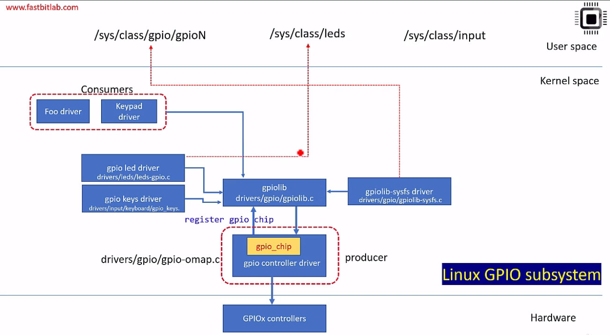

# GPIO

## GPIO interfaces in Linux BeagleBone

In order to make GPIO hardware transparent to the user there are 3 layers delivered:
- GPIO controller driver which communicates with hardware
- GPIO library which communicates with controller. This is used by other drivers
- client drivers

There are also other parts that creates `sysfs` (an interface for user space).

### Custom driver

In order to make a driver platform independent it is delivered in two parts:
- driver itself which is platform independent and reads GPIO data from device tree node
- device tree node which deliveres platform specifi information to a driver

#### GPIO device tree properties

There is a standard saying that each property should be named according to the following convention: `<function>-gpios`.

Example can be found in the [kernel documentation](https://www.kernel.org/doc/Documentation/gpio/board.txt).

Device tree properties are documented in kernel source in `dt-bindings` (as always).